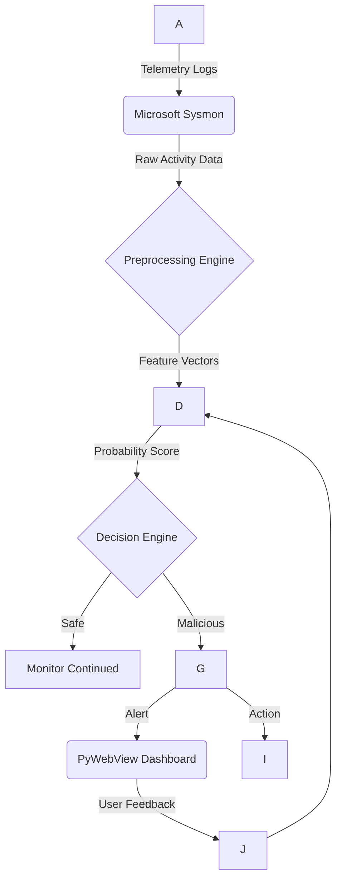

Here is the complete, premium **README.md** file for your GitHub repository, incorporating all research content, technical specifications, and architecture diagrams.

-----

# Advanced Behavioral Malware Detection: The SmartShield-AI Framework

<p align="center">

<!-- Core -->


<!-- Frontend -->


<!-- Backend -->


<!-- System -->


<!-- Data -->


<!-- Performance -->


<!-- Platform -->


<!-- Repo -->


</p>

**SmartShield-AI** is a proactive, intelligence-driven endpoint protection system that moves beyond reactive signature-based detection. By leveraging the **XGBoost** ensemble learning algorithm and **PyWebView**, it provides real-time behavioral analysis and surgical mitigation of polymorphic malware and zero-day exploits.[1]

**Website:** [smartshield-ai.github.io](https://smartshield-ai.github.io)

-----

## 🚀 Key Features

  * **Real-Time Telemetry:** Continuous monitoring of process creation, network activity, and registry changes using Microsoft Sysmon.[1]
  * **Dual-Analysis Engine:** Combines static structural analysis of Windows PE headers with dynamic runtime behavioral tracking.[1, 1]
  * **AI-Powered Classification:** High-fidelity detection using Extreme Gradient Boosting (XGBoost) trained on the EMBER dataset and custom malicious samples.[1]
  * **Premium Desktop UI:** A modern, high-performance dashboard built with **PyWebView (HTML5/CSS3)** for a seamless user experience.[1]
  * **Automated Mitigation:** Instant process termination and file quarantining upon high-confidence threat detection.[1]

-----

## 🏗️ System Architecture

SmartShield-AI operates as a synchronized pipeline that transforms raw system logs into actionable security intelligence.



-----

## 🔬 Technical Deep-Dive

### Feature Engineering

The system extracts highly discriminative attributes from **Windows Portable Executable (PE)** files to identify malicious intent [1, 1]:

| Category | Extracted Features |
| :--- | :--- |
| **Static Structural** | Linker/Subsystem Version, Major OS Version, Checksum [1, 1] |
| **Memory Specs** | Stack Reserve Size, Initialized Data Size, Header Size [1, 1] |
| **Security Flags** | DLL Characteristics, Section Entropy (Max/Min) [1, 1] |
| **Behavioral** | Entry Point Address, API Call Sequences, Registry Modifications [1, 1] |

### Mathematical Modeling

The core engine optimizes a regularized objective function to balance predictive power and model complexity [1]:

$$\mathcal{L}(\phi) = \sum_{i} l(\hat{y}_i, y_i) + \sum_{k} \Omega(f_k)$$

Where the regularization term $\Omega$ is defined as:

$$\Omega(f) = \gamma T + \frac{1}{2} \lambda \| w \|^2$$

This prevents overfitting and ensures high generalization across unseen malware variants.[1]

-----

## 📊 Performance Validation

Based on empirical analysis using balanced datasets, SmartShield-AI achieves industry-leading detection metrics [1]:

| Metric | Accuracy | Precision | Recall | F1-Score |
| :--- | :--- | :--- | :--- | :--- |
| **Value** | **95.4%** | **94.8%** | **93.9%** | **94.3%** |

  * **AUC-ROC:** 0.998 [1]
  * **Response Time:** \< 1-2 Seconds [1]

-----

## 🛠️ Requirements & Installation

### Hardware Specifications [1]

  * **Processor:** Intel i3 5th Gen (Minimum) | Intel i5/i7 (Recommended)
  * **RAM:** 4 GB (Minimum) | 8 GB+ (Recommended)
  * **Storage:** 200 MB free space (SSD preferred)

### Software Stack [1]

  * **OS:** Windows 10/11 (64-bit)
  * **Core:** Python 3.9+
  * **Libraries:** XGBoost, Scikit-Learn, Pandas, NumPy, Psutil, Pe-file
  * **Frontend:** PyWebView, HTML5, CSS3 (Tailwind/Modern UI)
  * **Backend:** FastAPI

### Installation

1.  **Enable Sysmon:** Ensure Microsoft Sysmon is installed and logging is active.
2.  **Clone the Repo:**
    ```bash
    git clone https://github.com/SmartShield-AI/SmartShield-AI.git
    cd SmartShield-AI
    ```
3.  **Install Dependencies:**
    ```bash
    pip install -r requirements.txt
    ```
4.  **Launch Application:**
    ```bash
    python main.py
    ```

-----

## 👥 Contributors

SmartShield-AI was developed at **Bharat College of Engineering, Badlapur**.[1, 1]

  * **Prajwal Kedari:** Lead AI Developer & Algorithm Designer [1, 1]
  * **Sarvesh Mandhare:** Backend Integration & API Development [1, 1]
  * **Pruthviraj Mane:** Frontend Engineer (PyWebView/UI) [1, 1]
  * **Shatakshi Jadhav:** Researcher & Documentation Lead [1, 1]
  * **Prof. Shital Gujar:** Project Mentor & Research Guide [1, 1]

Published in the *International Journal of Creative Research Thoughts (IJCRT)*, March 2026.[1, 1]

-----

## 📄 License

Distributed under the **MIT License**. See `LICENSE` for more information.[2, 1]

-----

*Disclaimer: This system is a research-based framework. While it provides high-accuracy detection, it should be used as part of a multi-layered security strategy.*
